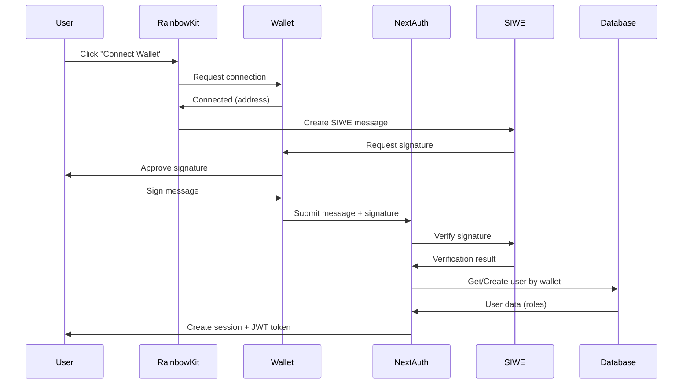

# Authentication & Authorization System Analysis - MusicNerdWeb

## Executive Summary

MusicNerdWeb implements a **Web3-first authentication system** using wallet-based sign-in via SIWE (Sign-In with Ethereum). The application uses NextAuth.js for session management combined with RainbowKit and Wagmi for seamless wallet integration. Authorization is handled through a role-based access control (RBAC) system with multiple privilege levels stored in the user database.

---

## 1. Authentication Libraries & Dependencies

### Core Authentication Stack
| Library | Version | Purpose |
|---------|---------|---------|
| **next-auth** | 4.24.11 | Authentication framework for Next.js |
| **siwe** | 2.3.2 | Sign-In with Ethereum message verification |
| **@rainbow-me/rainbowkit** | 2.1.7 | Wallet connection UI components |
| **@rainbow-me/rainbowkit-siwe-next-auth** | 0.4.1 | Integration between RainbowKit and NextAuth |
| **wagmi** | 2.18.1 | React hooks for Ethereum wallet interactions |
| **viem** | 2.30.5 | TypeScript utilities for Ethereum |
| **ethers** | 5.7.2 | Ethereum library for wallet operations |

### Configuration Files
- **Auth Config**: `src/server/auth.ts`
- **API Route**: `src/app/api/auth/[...nextauth]/route.ts`
- **Providers**: `src/app/_components/nav/components/LoginProviders.tsx`
- **Environment**: `src/env.ts`

---

## 2. Authentication Flow

### 2.1 Web3 Wallet Authentication (Production Mode)

The primary authentication method uses Ethereum wallet signatures:



#### Key Implementation Details

**File: `src/server/auth.ts` (Lines 156-289)**

The authentication uses a custom CredentialsProvider that:

1. **Accepts SIWE message and signature** (Lines 159-169)
2. **Validates CSRF token** from cookies (Lines 211-230)
3. **Verifies signature** against the SIWE message (Lines 234-254)
4. **Validates wallet address format** (Lines 257-260)
5. **Gets or creates user** in database (Lines 262-266)
6. **Returns user object** with roles (Lines 271-282)

```typescript
// Key authorization code snippet
const siwe = new SiweMessage(JSON.parse(credentials?.message || "{}"));
const result = await siwe.verify({
    signature: credentials?.signature || "",
    domain: normalizedMessageDomain,
    nonce: nonce,
});

if (!result.success) {
    console.error("[Auth] SIWE verification failed");
    return null;
}

let user = await getUserByWallet(siwe.address);
if (!user) {
    user = await createUser(siwe.address);
}
```

### 2.2 Guest Mode (Development Only)

**File: `src/server/auth.ts` (Lines 180-195)**

When `NEXT_PUBLIC_DISABLE_WALLET_REQUIREMENT=true` and `NODE_ENV !== 'production'`:

- Creates temporary guest user without wallet
- Auto-assigns whitelist privileges
- No signature verification required
- Used for local development and testing

```typescript
if (process.env.NEXT_PUBLIC_DISABLE_WALLET_REQUIREMENT === 'true') {
    const tempUserId = 'temp-' + Math.random().toString(36).substring(2);
    return {
        id: tempUserId,
        walletAddress: null,
        isWhiteListed: true,
        isAdmin: false,
        // ... other fields
    };
}
```

---

## 3. Token & Session Management

### 3.1 Session Strategy

**File: `src/server/auth.ts` (Lines 152-155)**

```typescript
session: {
    strategy: "jwt",
    maxAge: 30 * 24 * 60 * 60, // 30 days
}
```

- **Strategy**: JWT (JSON Web Token) - stateless, no server-side session store
- **Duration**: 30 days of inactivity before expiration
- **Storage**: HttpOnly cookies (cannot be accessed by JavaScript)

### 3.2 JWT Token Structure

**File: `src/server/auth.ts` (Type definitions at Lines 47-56)**

```typescript
interface JWT {
    walletAddress?: string;
    isWhiteListed?: boolean;
    isAdmin?: boolean;
    isSuperAdmin?: boolean;
    isHidden?: boolean;
    lastRefresh?: number;
}
```

### 3.3 Token Refresh Mechanism

**File: `src/server/auth.ts` (Lines 65-123)**

The JWT callback implements automatic token refresh:

```typescript
callbacks: {
    async jwt({ token, user, trigger }) {
        if (user) {
            // Initial login - copy user properties to token
            token.walletAddress = user.walletAddress;
            token.isWhiteListed = user.isWhiteListed;
            token.isAdmin = user.isAdmin;
            token.isSuperAdmin = user.isSuperAdmin;
            token.isHidden = user.isHidden;
            token.lastRefresh = Date.now();
        } else {
            // Refresh user data from database in these cases:
            // 1. Explicit session update trigger
            // 2. Token older than 5 minutes (for role changes)
            // 3. Missing critical properties
            const shouldRefresh =
                trigger === "update" ||
                !token.lastRefresh ||
                (Date.now() - token.lastRefresh) > 5 * 60 * 1000 ||
                token.isAdmin === undefined;

            if (shouldRefresh && token.walletAddress) {
                const refreshedUser = await getUserByWallet(token.walletAddress);
                // Update token with latest database values
            }
        }
        return token;
    }
}
```

**Refresh Triggers**:
- Manual session update (via `update` trigger)
- Every 5 minutes automatically
- When critical role properties are missing

**Purpose**: Ensures role changes (e.g., admin promotion) propagate to user sessions without requiring re-login.

### 3.4 Cookie Configuration

**File: `src/server/auth.ts` (Lines 295-314)**

```typescript
cookies: {
    sessionToken: {
        name: `${process.env.NODE_ENV === 'production' ? '__Secure-' : ''}next-auth.session-token`,
        options: {
            httpOnly: true,        // Cannot be read by JavaScript
            sameSite: 'lax',       // CSRF protection
            path: '/',
            secure: process.env.NODE_ENV === 'production', // HTTPS only in production
        },
    },
    csrfToken: {
        name: 'next-auth.csrf-token',
        options: {
            httpOnly: true,
            sameSite: 'lax',
            path: '/',
            secure: process.env.NODE_ENV === 'production',
        },
    },
}
```

**Security Features**:
- ✅ HttpOnly cookies prevent XSS attacks
- ✅ Secure flag in production (HTTPS only)
- ✅ SameSite=lax for CSRF protection
- ✅ CSRF token validation on authentication
- ✅ `__Secure-` prefix in production (browser-enforced security)

---

## 4. Role-Based Authorization System

### 4.1 User Roles

**Database Schema: `src/server/db/schema.ts` (Lines 78-92)**

```typescript
export const users = pgTable("users", {
    id: uuid("id").primaryKey(),
    wallet: text("wallet").notNull(),
    email: text("email"),
    username: text("username"),
    isAdmin: boolean("is_admin").default(false).notNull(),
    isWhiteListed: boolean("is_white_listed").default(false).notNull(),
    isSuperAdmin: boolean("is_super_admin").default(false).notNull(),
    isHidden: boolean("is_hidden").default(false).notNull(),
    acceptedUgcCount: bigint("accepted_ugc_count", { mode: "number" }),
    // ... timestamps
});
```

### 4.2 Role Definitions & Permissions

| Role | Description | Permissions |
|------|-------------|-------------|
| **isAdmin** | Site administrator | • Access admin dashboard<br>• Manage all users<br>• Approve/reject UGC submissions<br>• Modify user roles<br>• Automatically whitelisted |
| **isWhiteListed** | Approved contributor | • Add artists to database<br>• Submit UGC data<br>• Full platform access |
| **isSuperAdmin** | Super administrator | • Reserved for highest-level access<br>• Implementation-specific privileges |
| **isHidden** | Hidden user | • Excluded from public leaderboards<br>• Otherwise normal permissions |
| **Default** | Regular user | • View-only access<br>• Cannot add artists or submit UGC |

### 4.3 Role Hierarchy & Auto-Promotion

**File: `src/server/utils/queries/userQueries.ts` (Lines 137-143)**

```typescript
if (data.isAdmin !== undefined) {
    updateData.isAdmin = data.isAdmin;
    // Auto-whitelist admins
    if (data.isAdmin) {
        updateData.isWhiteListed = true;
    }
}
```

**Hierarchy**:
```
isSuperAdmin
    ↓
isAdmin (automatically gets isWhiteListed)
    ↓
isWhiteListed
    ↓
Default User
```

---

## 5. Protected Routes & Authorization Checks

### 5.1 Server-Side Route Protection Patterns

#### Pattern 1: Admin-Only API Routes

**Example: `src/app/api/admin/whitelist-user/[id]/route.ts` (Lines 12-23)**

```typescript
export async function PUT(request: NextRequest, { params }: { params: Promise<{ id: string }> }) {
    // 1. Check authentication
    const session = await getServerAuthSession();
    if (!session?.user?.id) {
        return NextResponse.json(
            { status: "error", message: "Not authenticated" },
            { status: 401 }
        );
    }

    // 2. Verify admin privileges
    const currentUser = await getUserById(session.user.id);
    if (!currentUser?.isAdmin) {
        return NextResponse.json(
            { status: "error", message: "Only admins can edit user roles" },
            { status: 403 }
        );
    }

    // 3. Proceed with authorized action
    const resp = await updateWhitelistedUser(id, body);
    return NextResponse.json(resp);
}
```

**HTTP Status Codes**:
- `401 Unauthorized`: No valid session
- `403 Forbidden`: Authenticated but insufficient privileges

#### Pattern 2: User-Specific Data Routes

**Example: `src/app/api/ugcCount/route.ts` (Lines 9-23)**

```typescript
export async function GET() {
    const session = await getServerAuthSession();
    if (!session || !session.user?.id) {
        return NextResponse.json({ count: 0 }, { status: 200 });
    }

    // Return data specific to authenticated user
    const items = await db.query.ugcresearch.findMany({
        where: eq(ugcresearch.userId, session.user.id),
    });

    return NextResponse.json({ count: items.length });
}
```

**Pattern**: Gracefully return empty data for unauthenticated requests instead of errors.

#### Pattern 3: Admin-Filtered Data Routes

**Example: `src/app/api/pendingUGCCount/route.ts` (Lines 11-21)**

```typescript
export async function GET() {
    const session = await getServerAuthSession();
    if (!session || !session.user?.id) {
        return NextResponse.json({ count: 0 }, { status: 200 });
    }

    const dbUser = await getUserById(session.user.id);
    if (!dbUser?.isAdmin) {
        // Non-admin users shouldn't see pending info
        return NextResponse.json({ count: 0 }, { status: 200 });
    }

    const pending = await getPendingUGC();
    return NextResponse.json({ count: pending.length });
}
```

### 5.2 Server Actions Protection

**Example: `src/app/actions/addArtist.ts` (Lines 8-22)**

```typescript
export async function addArtist(spotifyId: string): Promise<AddArtistResp> {
    const session = await getServerAuthSession();
    const isWalletRequired = process.env.NEXT_PUBLIC_DISABLE_WALLET_REQUIREMENT !== 'true';

    if (isWalletRequired && !session) {
        throw new Error("Not authenticated");
    }

    // Proceed with artist addition
    const user = await getUserById(session.user.id);
    const result = await dbAddArtist(spotifyId);

    return result;
}
```

**Key Point**: Server actions use exceptions for unauthorized access, which are caught and displayed to the user by the client.

### 5.3 Server-Side Page Protection

**Example: `src/app/admin/page.tsx` (Lines 11-32)**

```typescript
export default async function Admin() {
    const walletlessEnabled =
        process.env.NEXT_PUBLIC_DISABLE_WALLET_REQUIREMENT === 'true' &&
        process.env.NODE_ENV !== 'production';

    let isAuthorized = false;

    if (walletlessEnabled) {
        isAuthorized = true;
    } else {
        const session = await getServerAuthSession();
        const user = session?.user;

        if (!user) {
            return <PleaseLoginPage text="Log in to access this page" />;
        }

        const userRecord = await getUserById(user.id);
        if (!userRecord || !userRecord.isAdmin) {
            return <PleaseLoginPage text="You are not authorized to access this page" />;
        }

        isAuthorized = true;
    }

    // Render admin interface
    const [pendingUGCData, allUsers] = await Promise.all([
        getPendingUGC(),
        getAllUsers(),
    ]);

    return <AdminDashboard data={...} />;
}
```

**Pattern**: Server components check authorization before data fetching, returning error pages for unauthorized access.

### 5.4 Client-Side Protection

**Example: `src/app/_components/nav/components/Login.tsx` (Lines 465-474)**

```typescript
{session?.user?.isAdmin && (
    <DropdownMenuItem asChild className="flex items-center gap-2">
        <Link href="/admin" prefetch>
            <span>Admin Panel</span>
            {hasPendingUGC && (
                <span className="inline-block h-2 w-2 rounded-full bg-red-600" />
            )}
        </Link>
    </DropdownMenuItem>
)}
```

**Purpose**: Hide UI elements based on user roles. This is NOT a security measure but improves UX.

**Security Note**: Client-side checks are for UI/UX only. All actual authorization MUST happen server-side.

### 5.5 Summary of Protected Routes

#### Admin-Only Routes
- `GET/PUT /api/admin/whitelist-user/[id]` - User management
- `GET /api/pendingUGCCount` - Admin notifications
- `GET /admin` - Admin dashboard page

#### Authentication Required Routes
- `POST /api/addArtist` - Add artists (requires whitelist)
- `GET /api/ugcCount` - User's UGC count
- `GET /api/userEntries` - User's contributions
- `PUT /api/user/[id]` - Update user profile
- `DELETE /api/removeArtistData` - Remove artist data

#### Public Routes (No Auth Required)
- `GET /api/searchArtists` - Search functionality
- `GET /api/artistBio/[id]` - Artist biographies
- `GET /api/leaderboard` - Public leaderboard
- `GET /api/validateLink` - Link validation
- `GET /` - Home page
- `GET /artist/[id]` - Artist pages

---

## 6. Session Security Features

### 6.1 CSRF Protection

**File: `src/server/auth.ts` (Lines 211-232)**

```typescript
// Get CSRF token from cookies
const csrfToken = (await cookies()).get('next-auth.csrf-token')?.value;

if (!csrfToken) {
    console.error("[Auth] CSRF token not found in cookies");
    return null;
}

// Extract nonce from CSRF token
let nonce = csrfToken;
if (csrfToken.includes('|')) {
    nonce = csrfToken.split('|')[0]; // Handle pipe-separated format
}

// Use nonce for SIWE verification
const result = await siwe.verify({
    signature: credentials?.signature || "",
    domain: normalizedMessageDomain,
    nonce: nonce,
});
```

**Protection Mechanism**:
1. NextAuth generates CSRF token
2. Token stored in httpOnly cookie
3. SIWE message must include token as nonce
4. Signature verification fails if nonce doesn't match

### 6.2 Domain Validation

**File: `src/server/auth.ts` (Lines 198-244)**

```typescript
const siwe = new SiweMessage(JSON.parse(credentials?.message || "{}"));
const authUrl = new URL(NEXTAUTH_URL);

// Normalize domains by removing port numbers
const normalizedMessageDomain = siwe.domain.split(':')[0];
const normalizedAuthDomain = authUrl.hostname.split(':')[0];

const result = await siwe.verify({
    signature: credentials?.signature || "",
    domain: normalizedMessageDomain,
    nonce: nonce,
});
```

**Protection**: Ensures the SIWE message was intended for this domain, preventing replay attacks from other sites.

### 6.3 Wallet Synchronization

**File: `src/app/_components/nav/components/Login.tsx` (Lines 323-336)**

```typescript
useEffect(() => {
    let timeoutId: NodeJS.Timeout | null = null;
    if (!isConnected && status === "authenticated") {
        // Grace period to avoid false disconnections during page load
        timeoutId = setTimeout(() => {
            if (!isConnected) {
                signOut({ redirect: false }); // Clear session if wallet disconnected
            }
        }, 1500);
    }
    return () => {
        if (timeoutId) clearTimeout(timeoutId);
    };
}, [isConnected, status]);
```

**Protection**: Automatically signs out user if wallet is disconnected, maintaining consistency between wallet state and session state.

### 6.4 Session Refresh on Role Changes

**File: `src/server/auth.ts` (Lines 76-120)**

The JWT callback refreshes user data from the database every 5 minutes, ensuring that:
- Admin promotions take effect within 5 minutes
- Revoked whitelist access is enforced quickly
- Hidden status updates propagate to sessions

---

## 7. Environment Variables

### 7.1 Required Variables

**File: `src/env.ts`**

```bash
# NextAuth Configuration
NEXTAUTH_URL=https://www.musicnerd.xyz
NEXTAUTH_SECRET=<random-secret-string>

# Database
SUPABASE_DB_CONNECTION=postgresql://...

# External APIs
NEXT_PUBLIC_SPOTIFY_WEB_CLIENT_ID=<spotify-client-id>
NEXT_PUBLIC_SPOTIFY_WEB_CLIENT_SECRET=<spotify-secret>
OPENAI_API_KEY=<openai-key>
DISCORD_WEBHOOK_URL=<discord-webhook>
```

### 7.2 Development-Only Variables

```bash
# Disable wallet requirement (dev only)
NEXT_PUBLIC_DISABLE_WALLET_REQUIREMENT=true

# Enable debug logging
NODE_ENV=development
```

**Security Note**: `NEXT_PUBLIC_DISABLE_WALLET_REQUIREMENT` is explicitly checked to only work in non-production environments:

```typescript
const walletlessEnabled =
    process.env.NEXT_PUBLIC_DISABLE_WALLET_REQUIREMENT === 'true' &&
    process.env.NODE_ENV !== 'production';
```

---

## 8. Authentication Helper Functions

### 8.1 Get Server Session

**File: `src/server/auth.ts` (Lines 317-322)**

```typescript
/**
 * Wrapper for `getServerSession` so that you don't need to import
 * the `authOptions` in every file.
 */
export const getServerAuthSession = () => getServerSession(authOptions);
```

**Usage**: Called from server components, API routes, and server actions to retrieve the current session.

### 8.2 User Queries

**File: `src/server/utils/queries/userQueries.ts`**

```typescript
// Get user by wallet address
export async function getUserByWallet(wallet: string)

// Get user by database ID
export async function getUserById(id: string)

// Create new user
export async function createUser(wallet: string)

// Get all users (admin only)
export async function getAllUsers()

// Update user roles (admin only)
export async function updateWhitelistedUser(userId: string, data: {...})
```

---

## 9. Security Best Practices Implemented

### ✅ Implemented

1. **HttpOnly Cookies**: Prevents XSS attacks from stealing session tokens
2. **CSRF Protection**: NextAuth built-in CSRF tokens validated on authentication
3. **Secure Cookie Flag**: Production cookies only transmitted over HTTPS
4. **SameSite Cookie Policy**: Protects against CSRF attacks
5. **JWT Token Expiry**: 30-day sessions with automatic cleanup
6. **Role Refresh Mechanism**: Role changes propagate within 5 minutes
7. **Server-Side Authorization**: All protected operations validate on the server
8. **Domain Validation**: SIWE messages validated against expected domain
9. **Wallet Address Validation**: Regex validation of Ethereum addresses
10. **Database Retry Logic**: Handles transient connection errors gracefully
11. **Environment-Based Security**: Enhanced security settings in production
12. **Signature Verification**: Cryptographic proof of wallet ownership
13. **Auto-Logout on Wallet Disconnect**: Maintains session consistency

### 🔶 Considerations for Enhancement

1. **Rate Limiting**: Consider implementing rate limits on authentication endpoints
2. **Session Revocation**: Currently no way to force-logout all user sessions
3. **IP Logging**: Could log authentication attempts for security auditing
4. **2FA Option**: Consider adding optional two-factor authentication
5. **Session Activity Tracking**: Track last activity timestamp for security monitoring
6. **Middleware Protection**: Could implement Next.js middleware for route-level protection
7. **API Key Rotation**: Implement rotation strategy for NEXTAUTH_SECRET

---

## 10. Common Authorization Patterns

### Pattern 1: Check Authentication Only

```typescript
const session = await getServerAuthSession();
if (!session?.user?.id) {
    return NextResponse.json({ error: "Unauthorized" }, { status: 401 });
}
// Proceed with authenticated user
```

### Pattern 2: Check Admin Role

```typescript
const session = await getServerAuthSession();
if (!session?.user?.id) {
    return NextResponse.json({ error: "Unauthorized" }, { status: 401 });
}

const user = await getUserById(session.user.id);
if (!user?.isAdmin) {
    return NextResponse.json({ error: "Forbidden" }, { status: 403 });
}
// Proceed with admin action
```

### Pattern 3: Check Whitelist Status

```typescript
const session = await getServerAuthSession();
if (!session?.user?.id) {
    throw new Error("Not authenticated");
}

const user = await getUserById(session.user.id);
if (!user?.isWhiteListed) {
    throw new Error("Must be whitelisted to add artists");
}
// Proceed with whitelisted action
```

### Pattern 4: Development Bypass

```typescript
const walletlessEnabled =
    process.env.NEXT_PUBLIC_DISABLE_WALLET_REQUIREMENT === 'true' &&
    process.env.NODE_ENV !== 'production';

if (!walletlessEnabled) {
    const session = await getServerAuthSession();
    if (!session) {
        return <LoginRequired />;
    }
}
// Proceed with action
```

---

## 11. Web3 Provider Configuration

### RainbowKit Setup

**File: `src/app/_components/nav/components/LoginProviders.tsx` (Lines 55-64)**

```typescript
<RainbowKitSiweNextAuthProvider
    getSiweMessageOptions={() => ({
        statement: 'Sign in to MusicNerd to add artists and manage your collection.',
        nonce: undefined,                    // Generated by NextAuth
        chainId: undefined,                  // Any chain accepted
        domain: window.location.host,        // Current domain
        uri: window.location.origin,         // Current origin
        expirationTime: new Date(Date.now() + 1000 * 60 * 5).toISOString(), // 5 min
    })}
    enabled={true}
>
```

**Configuration Details**:
- **Statement**: User-friendly message shown during wallet signing
- **Expiration**: SIWE message valid for 5 minutes
- **Chain-Agnostic**: Accepts signatures from any Ethereum chain
- **Domain Binding**: Signature bound to current domain

### Wagmi Configuration

**File: `src/app/_components/nav/components/LoginProviders.tsx` (Lines 30-41)**

```typescript
walletConfig = getDefaultConfig({
    appName: 'Music Nerd',
    appDescription: 'Music Nerd platform',
    appUrl: window.location.origin,
    appIcon: 'https://www.musicnerd.xyz/icon.ico',
    projectId: '929ab7024658ec19d047d5df44fb0f63', // WalletConnect project ID
    chains: [mainnet],
    transports: {
        [mainnet.id]: http()
    },
    ssr: true // Server-side rendering support
});
```

---

## 12. Testing Considerations

### Test Utilities

**File: `src/server/utils/queries/userQueries.ts` (Lines 32-48)**

```typescript
// Retry helper for transient DB errors
async function withDbRetry<T>(
    operation: () => Promise<T>,
    retries: number = 2,
    delayMs: number = 300
): Promise<T> {
    try {
        return await operation();
    } catch (error: any) {
        const isTransient =
            code === 'CONNECT_TIMEOUT' ||
            /ETIMEDOUT|ECONNRESET|EHOSTUNREACH/i.test(message);

        if (retries > 0 && isTransient) {
            await new Promise((r) => setTimeout(r, delayMs));
            return withDbRetry(operation, retries - 1, delayMs * 2);
        }
        throw error;
    }
}
```

### Environment Variables for Testing

**File: `src/env.ts` (Lines 1-10)**

```typescript
function validateEnv<T extends string>(
    value: T | undefined,
    name: string,
    isTest = false
): T {
    if (!value) {
        if (isTest) {
            return 'test-value' as T; // Allow tests to run without real credentials
        }
        throw new Error(`${name} environment variable is required`);
    }
    return value;
}
```

---

## 13. Key Takeaways

### Authentication
- ✅ Web3-native using SIWE for wallet-based authentication
- ✅ Fallback guest mode for local development
- ✅ Comprehensive signature and domain validation
- ✅ CSRF protection through nonce validation

### Authorization
- ✅ Role-based access control with 4 distinct roles
- ✅ Hierarchical role system with auto-promotion
- ✅ Server-side validation on all protected operations
- ✅ Automatic role refresh every 5 minutes

### Session Management
- ✅ Stateless JWT tokens with 30-day expiration
- ✅ Secure httpOnly cookies with production hardening
- ✅ Wallet synchronization to maintain session consistency
- ✅ Automatic token refresh for role updates

### Security
- ✅ Multiple layers of protection (CSRF, XSS, HTTPS)
- ✅ Environment-aware security settings
- ✅ Comprehensive error handling and logging
- ✅ Input validation on all user data

---

## 14. Additional Resources

### Key Files Reference
- **Authentication**: `src/server/auth.ts`
- **API Route**: `src/app/api/auth/[...nextauth]/route.ts`
- **Web3 Providers**: `src/app/_components/nav/components/LoginProviders.tsx`
- **Login Component**: `src/app/_components/nav/components/Login.tsx`
- **User Queries**: `src/server/utils/queries/userQueries.ts`
- **Database Schema**: `src/server/db/schema.ts`

### External Documentation
- [NextAuth.js Documentation](https://next-auth.js.org/)
- [SIWE Documentation](https://docs.login.xyz/)
- [RainbowKit Documentation](https://www.rainbowkit.com/)
- [Wagmi Documentation](https://wagmi.sh/)

---

**Document Version**: 1.0
**Last Updated**: 2025-11-21
**Analyzed By**: Claude AI Assistant
