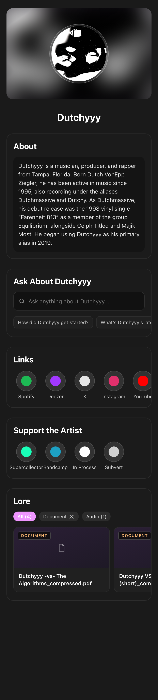
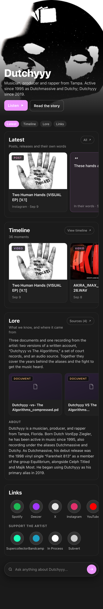
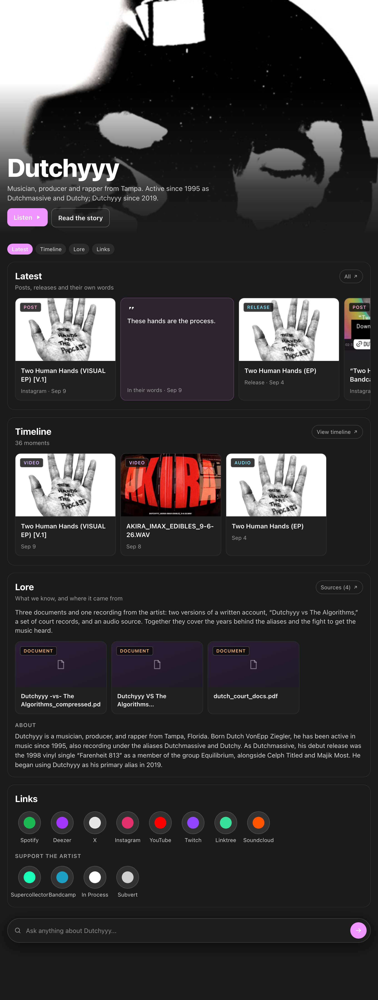
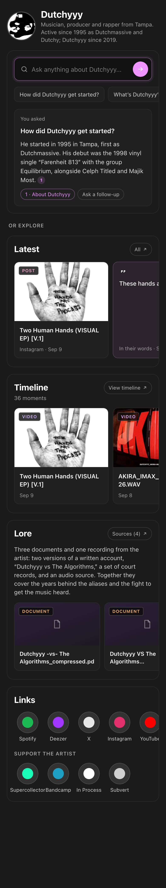
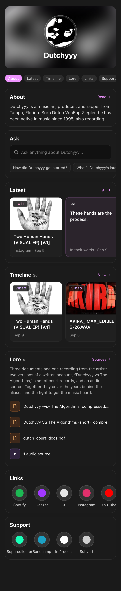

# Artist page redesign: three directions

Design record, 2026-09-10. Static, phone-first mockups of the artist profile, brought to the
2026-09-11 call for direction. Tracking issue: xdjs/MusicNerdWeb#1230.

## What the team has already said

Latest goes after About ([Sep 3 design review](../../meetings/2026-09-03-profile-design.md)).
Use a compact phone screen to drive the layout (Carl, [Sep 7](../../meetings/2026-09-07.md)).
Lore files render poorly and their imagery should be surfaced; a two-to-three sentence summary
under the pills (Carl, [Sep 10](../../meetings/2026-09-10.md)). Bookmarks removed. Pete: "a
museum for an artist that's interesting to go through, not just a graph." CY: today is
"features glommed together with naive information architecture."

All boards use Dutchyyy's real profile, links, Lore files and In Process moments. The Lore
summary and the Ask answer are sample copy. The Timeline section is the approved Direction A
from the [Timeline design record](../2026-09-10-timeline-section/README.md), tracked in #1228.

## Today, for reference

## A · Museum (leading candidate)

The portrait becomes the page. Name and a one-line bio over the image, one primary action
(Listen), then the story in order: Latest, Timeline, Lore, Links. About folds into Lore, since
it is what we know about the artist. Ask becomes a persistent bar at the bottom so it is one
tap away everywhere.

Why: it answers Pete's museum brief and CY's IA complaint with one move: the artist's own image
and work lead, chrome recedes.

Tradeoff: needs a good portrait. Artists with only a Deezer thumbnail get a weaker hero;
fallback is today's blurred-backdrop treatment.

## B · Ask-led

The question box is the front door: compact header, the Ask input with suggested questions, and
an answered state right there with a numbered source chip. Everything else sits below under
"Or explore".

Why: Ask is the thing no other artist page has, and the interview answers feed it. This is the
layout Pete and Tom explored on Sep 7.

Tradeoff: the very question raised that day: long answers push the rest of the page down. The
board shows a short answer; a three-paragraph one needs a collapse or a sheet.

## C · Compact stack

Today's structure, tightened: smaller hero, a sticky section tab bar, every section a dense card
with a "see all". About clamps to three lines. Lore documents become a list instead of cards.

Why: Carl's compact-mobile constraint taken literally. Fastest to scan, cheapest to build,
nothing moves for artists who already know the page.

Tradeoff: least distinctive. It fixes density, not the "glommed together" feeling.

## Open for Friday

1. Does About stay its own section, or fold into Lore (A) / clamp to three lines (C)?
2. Ask: persistent bar (A), front door (B), or a section (C)?
3. Latest before Timeline, or merge In Process moments into Latest as one feed?
4. The Lore summary is generated. Who approves it: the artist, or nobody?
5. Hero: a full-bleed portrait needs artist-supplied images. Is that a claim-flow step?
