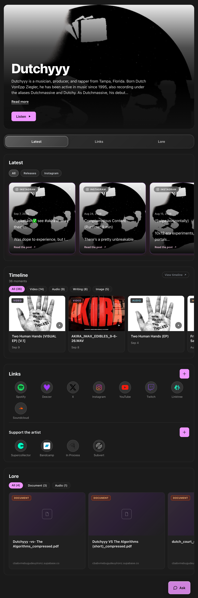
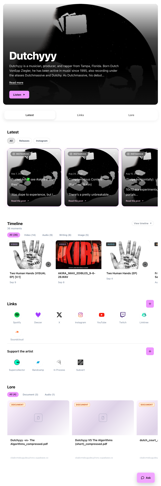
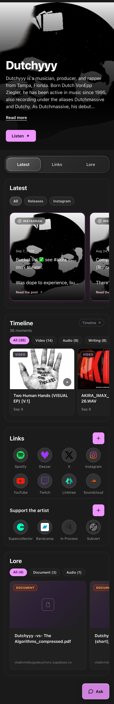
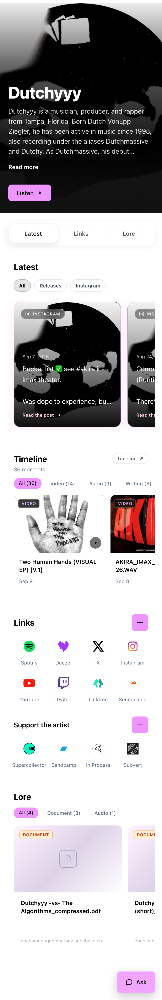

# Timeline section: In Process moments on the artist page

> **2026-09-14 — folded into Latest.** At standup the team asked for In Process moments to live
> inside the Latest section next to Releases, Instagram and interview answers, not as a section of
> their own. Direction A shipped to `staging` as a standalone section (#1250) and was then merged into
> Latest (#1228, PR row "Merge Timeline into Latest"): moments become Latest cards in the existing
> card vocabulary, `#mn-timeline` is gone, and the rail keeps its three tabs. The boards below record
> the standalone direction as built; the open questions about a fourth rail tab are moot.

Design record, 2026-09-10, revised 2026-09-13. Static mockups for the feature Carl proposed at
the [September 10 R&D sync](../../meetings/2026-09-10.md): show an artist's music NFTs on
their profile using In Process's existing index and API. Tracking issue: xdjs/MusicNerdWeb#1228.

Read-only on purpose. v1 displays moments and links out; no collect or mint actions.

## Decision

**Direction A ("Shelf") is the build target.** Two alternatives (a dated journal and a
featured-moment layout) were explored on 2026-09-10 and dropped on 2026-09-13 to keep the
section simple: A adds no new vocabulary to the page.

## Data

Every board uses real data from Dutchyyy's In Process timeline
(`GET https://api.inprocess.world/api/timeline?artist=<address>`, public, no auth). As of
2026-09-13 that response carries each moment's metadata inline (`name`, `description`,
`image`, `content.mime`), so no second call to `/api/metadata` is needed. The address comes
from the artist's In Process link already stored in `artists.inprocess`.

## Page context

The boards sit inside the profile that shipped on 2026-09-12 (#1234): hero, the
Latest / Links / Lore rail, Latest cards, Links with the Support the artist row, Lore, and
the persistent Ask button. **Timeline sits after Latest and before Links.** The rail is
shown as shipped with three tabs; whether Timeline gets a fourth tab is open (below).

Both themes are included. Light boards use the shipped light tokens exactly: white page,
`.glass` at 55% white, so section bounds are near-invisible in light mode, as on the live
site today.

## A · Shelf

Mirrors the Lore section: filter pills by content type (pastypink active, `glass-subtle`
inactive), a horizontal card row on the `glass-subtle` shell, a type badge over the artwork
on a near-black backdrop so it reads on any image, title and date. "View timeline" links out
to the artist's In Process page. Tradeoff: the artist's writing behind each moment is one tap
away, not on the page.

| Desktop, dark | Desktop, light |
|---|---|
|  |  |

| Phone, dark | Phone, light |
|---|---|
|  |  |

At phone width the pills and cards scroll horizontally, matching Latest and Lore.

## Decisions so far

- Section title is **Timeline**, no In Process logo in the header. The scribble mark stays
  on the Support the artist link.
- Subtitle reads "Latest moments". The timeline API paginates without a total, so a count would only ever be the 12 the section fetches; decided 2026-09-13. Collection names are not shown in v1.
- Badges over artwork use a near-black backdrop so the label reads on any image.
- No collect chip or button anywhere. Every action is a read.
- Placement: after Latest, before Links.

## Open

1. Rail: keep the three shipped tabs, or add Timeline as a fourth?
2. Pinning: Carl wants displayed moments pinned so they stay. Pin to Arweave, or "always show"?
3. Which moments: the API carries a `hidden` list per moment; v1 skips those.
4. Collect is deferred. v1 links out to In Process; minting in place is a later write feature.
