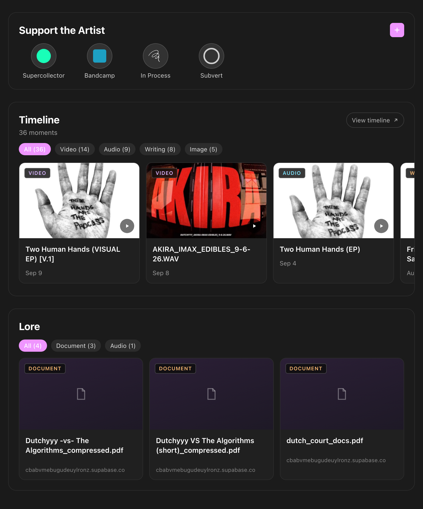
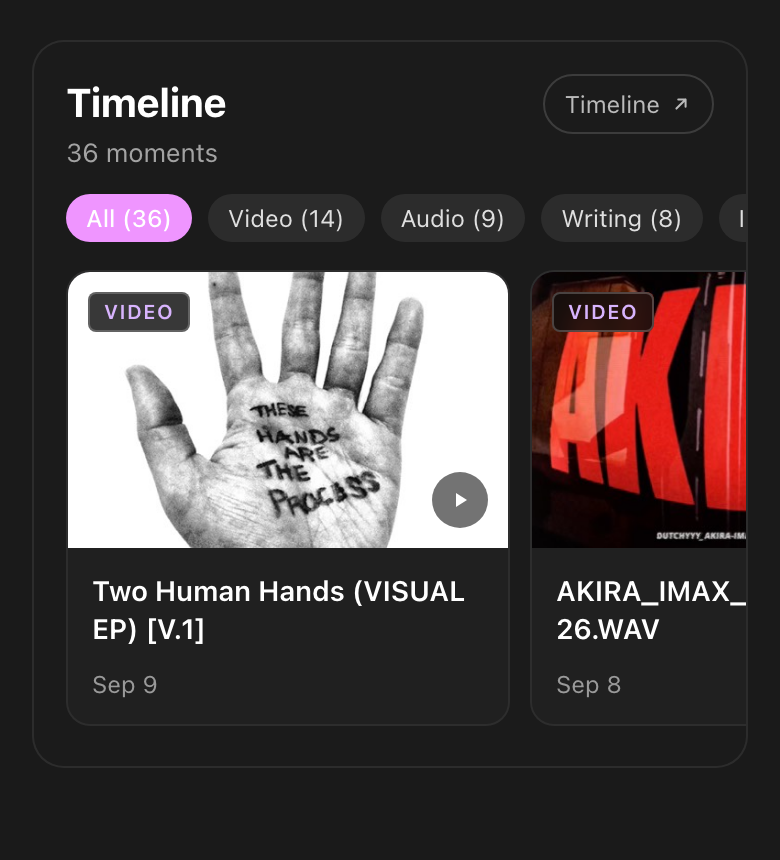
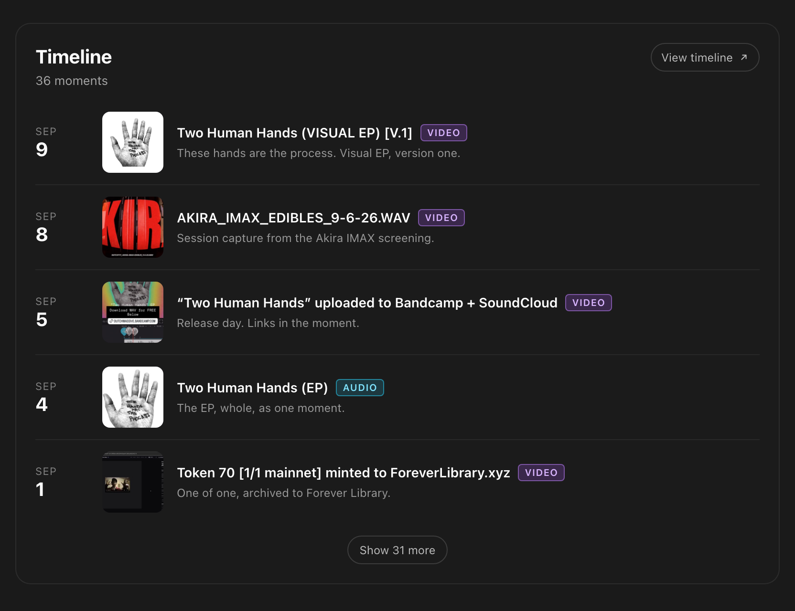
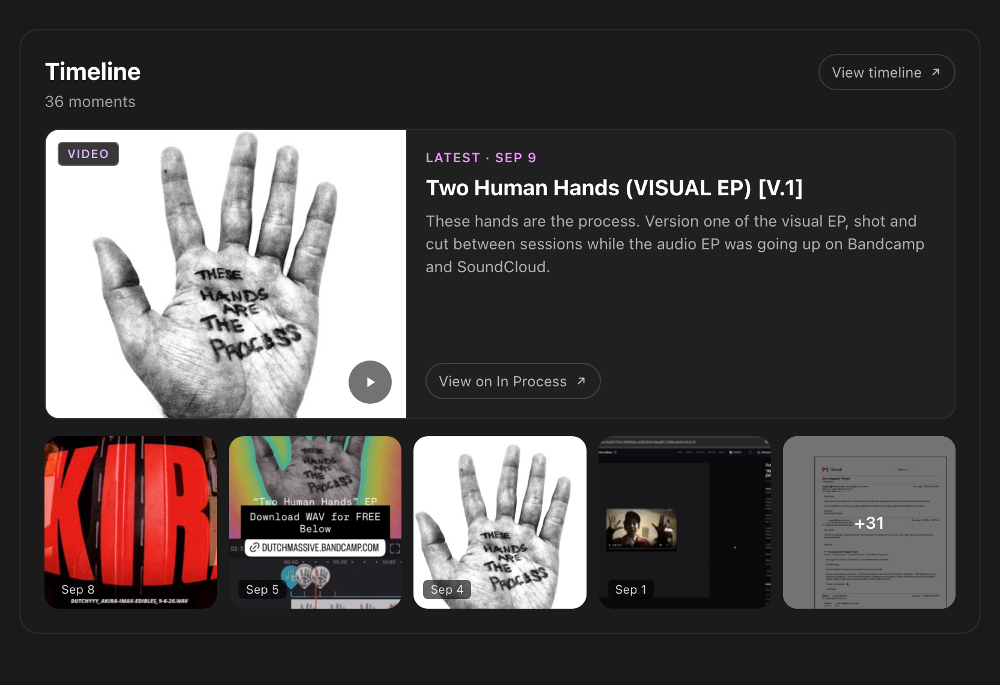

# Timeline section: In Process moments on the artist page

Design record, 2026-09-10. Static mockups for the feature Carl proposed at the
[September 10 R&D sync](../../meetings/2026-09-10.md): show an artist's music NFTs on their
profile using In Process's existing index and API. Tracking issue: xdjs/MusicNerdWeb#1228.

Read-only on purpose. v1 displays moments and links out; no collect or mint actions.

## Data

Every board uses real data from Dutchyyy's In Process timeline
(`GET https://api.inprocess.world/api/timeline?artist=<address>`, public, no auth), with
titles and artwork resolved through `GET /api/metadata?uri=<ar://...>`. The address comes
from the artist's In Process link already stored in `artists.inprocess`. One-line
descriptions on B and C are sample copy.

## Directions

All three reuse the shipped profile vocabulary: the `.glass` section, the Lore card, the
pink filter pill, the 48px link circle. Any of them is a one-day build.

### A · Shelf (leading candidate)

Mirrors the Lore section: filter pills by content type, a horizontal card row, a type badge
over the artwork, title and date. Zero new vocabulary. Tradeoff: the artist's writing behind
each moment is one tap away, not on the page.

### B · Journal

Dated rows with a thumbnail and one line of the artist's own description. Shows the process,
not just the artifacts. Tradeoff: tallest option.

### C · Featured

Newest moment large with its description, older ones as a square strip. Gives the latest
work a hero. Tradeoff: leans on the newest moment having a strong image.

## Decisions so far

- Section title is **Timeline**, no In Process logo in the header. The scribble mark stays
  on the Support the Artist link.
- Subtitle is the moment count only. Collection names are not shown in v1.
- Badges over artwork use a near-black backdrop so the label reads on any image.
- No collect chip or button anywhere. Every action is a read.

## Open for Friday

1. Placement: after Support the Artist, or inside the coming Latest section?
2. Pinning: Carl wants displayed moments pinned so they stay. Pin to Arweave, or "always show"?
3. Which moments: all, or only those the artist has not hidden? The API carries a `hidden`
   list per moment.
4. Collect is deferred. v1 links out to In Process; minting in place is a later write feature.
